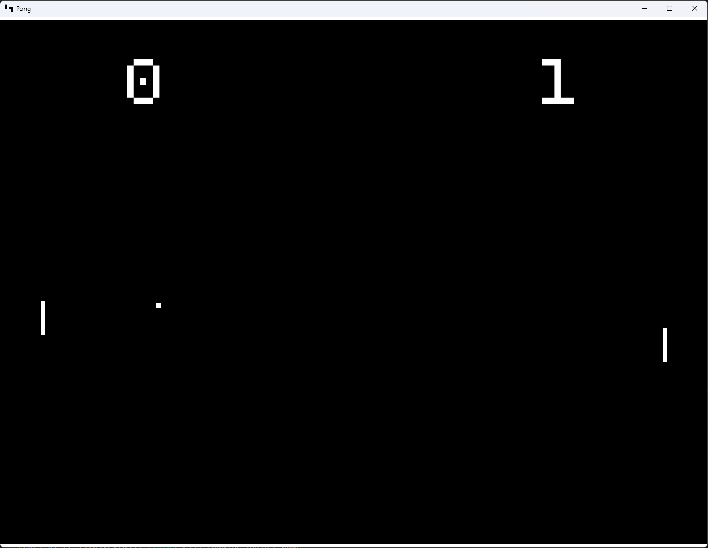
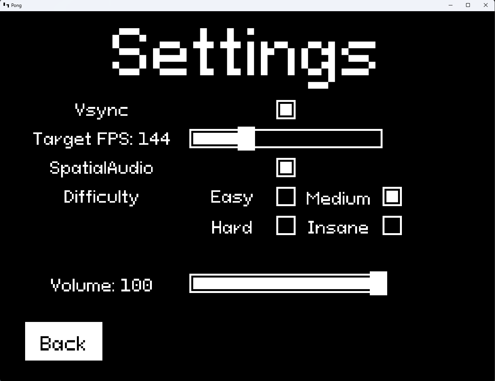

# pong

A simple recreation of classic pong using a made-from-scratch 2D game engine.
\
\
&nbsp;


\
\
&nbsp;

## Noteworthy features:
- **Real-time logger:** A custom made logger that adheres to real-time programming techniques to provide little overhead for the game loop thread.
- **Font rendering:** Any custom user fonts can be loaded and displayed as text objects easily.
- **Audio system:** The audio system also adheres to real-time programming constraints to eliminate drop-outs
- **Collision detection:** Each frame, the collision boxes on any game objects in the scene are calculated and provide callbacks if a collision is detected.
- **UI Elements:** Some choice UI elements such as buttons, text, sliders, and checkboxes can be used to display information and take in user input.
- **Realtime settings:** Settings such as the framerate, vsync, audio volume, positional audio can be changed in real time from the settings menu.
\
\
&nbsp;
\
&nbsp;


## Building
Clone repo
```
git clone https://github.com/jonmgomez/pong.git
cd pong
```

Create build directory
```
mkdir build && cd build
```

Build with CMake
```
cmake ..
cmake --build . -j 10
```

Run with config file passed in
```
./Debug/pong.exe ../pong_config.json
```

Third Party Libraries:
- [AudioFile](https://github.com/adamstark/AudioFile) Used for reading in .wav files to be played
- [concurrentqueue](https://github.com/cameron314/concurrentqueue) A lock-free used to create the real-time logger and real time audio system.
- [fmt](https://github.com/fmtlib/fmt) Formatting library for log statements before being passed to the logger.
- [glfw](https://github.com/glfw/glfw) & [glew](https://github.com/nigels-com/glew) For better communication with OpenGL
- [glm](https://github.com/g-truc/glm) Math library with great compatibility with OpenGL
- [json](https://github.com/nlohmann/json) For parsing JSON scene and config files.
- [portaudio](https://github.com/PortAudio/portaudio) Main audio driver
- [spdlog](https://github.com/gabime/spdlog) Logging library
- [stb](https://github.com/nothings/stb) Utility library for loading in image files, and parsing true type font files
